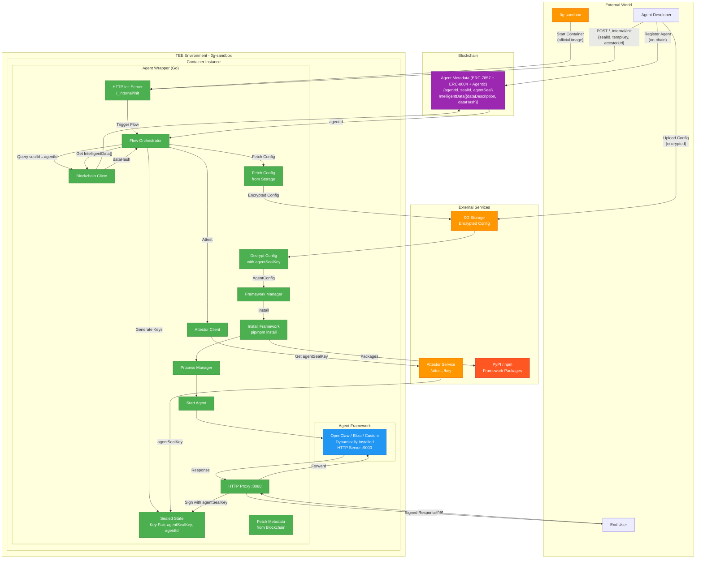
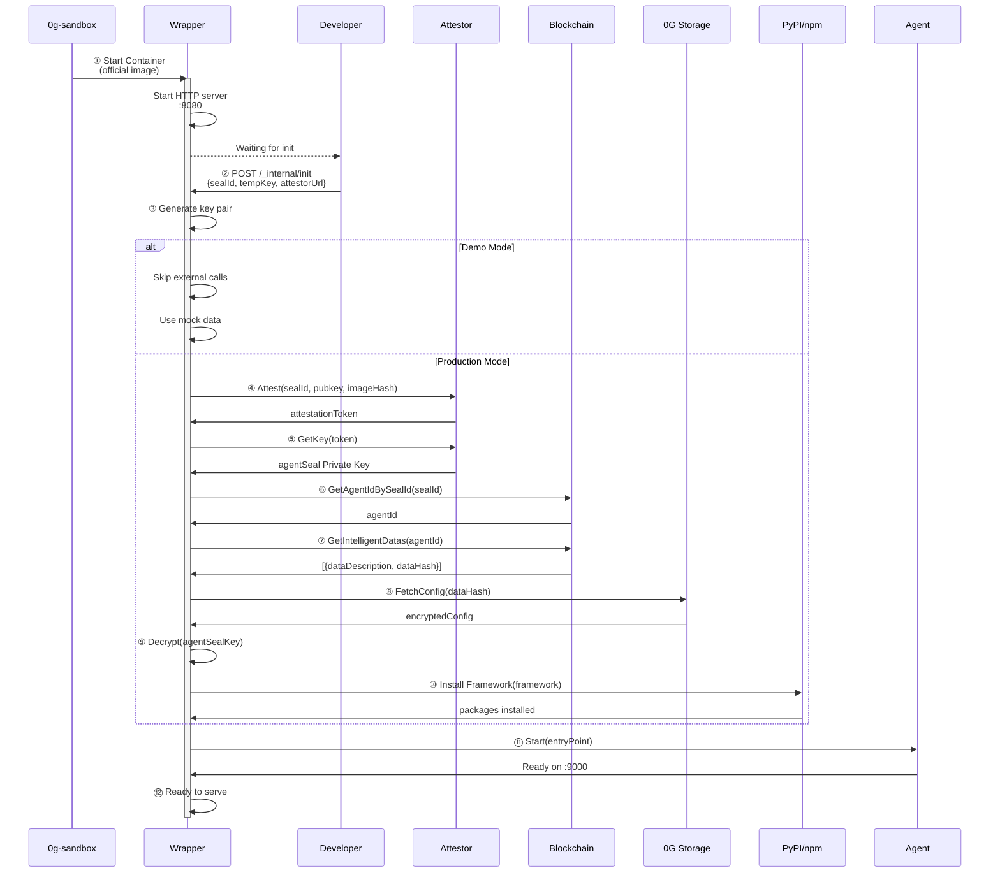
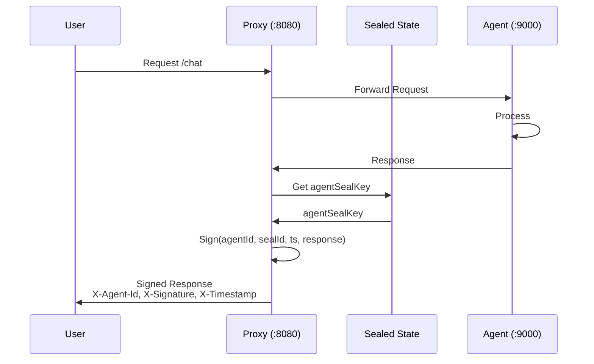
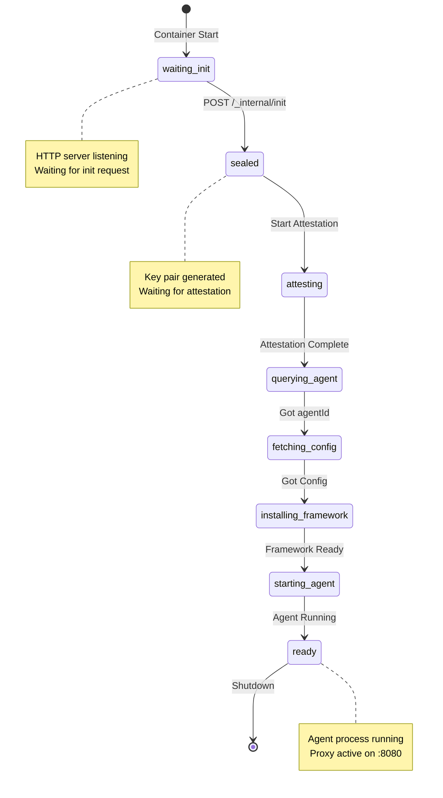
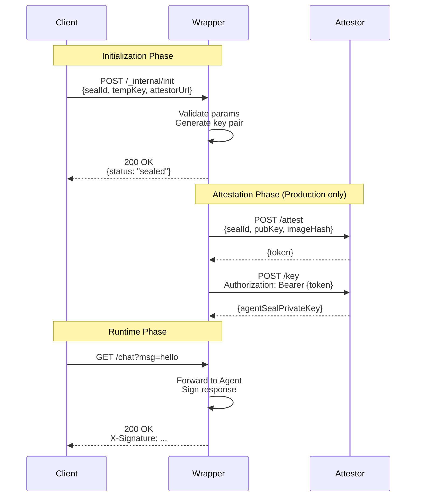
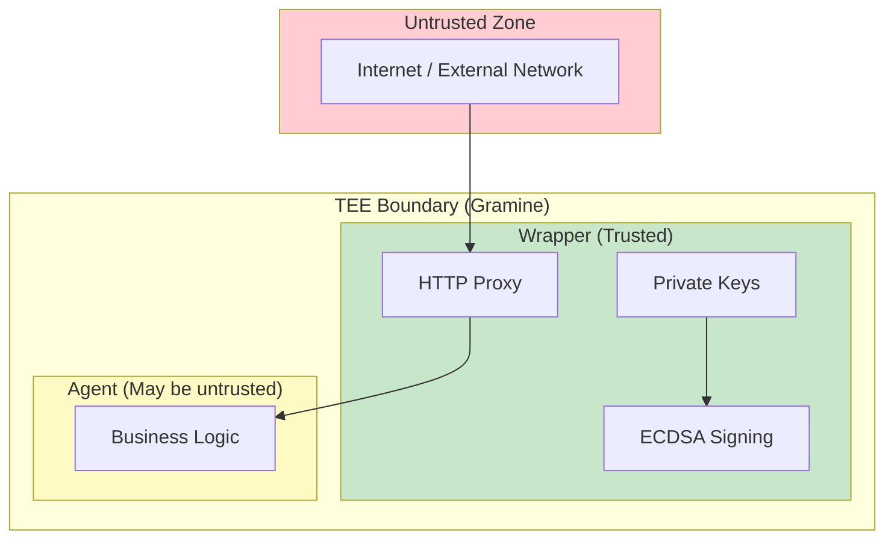
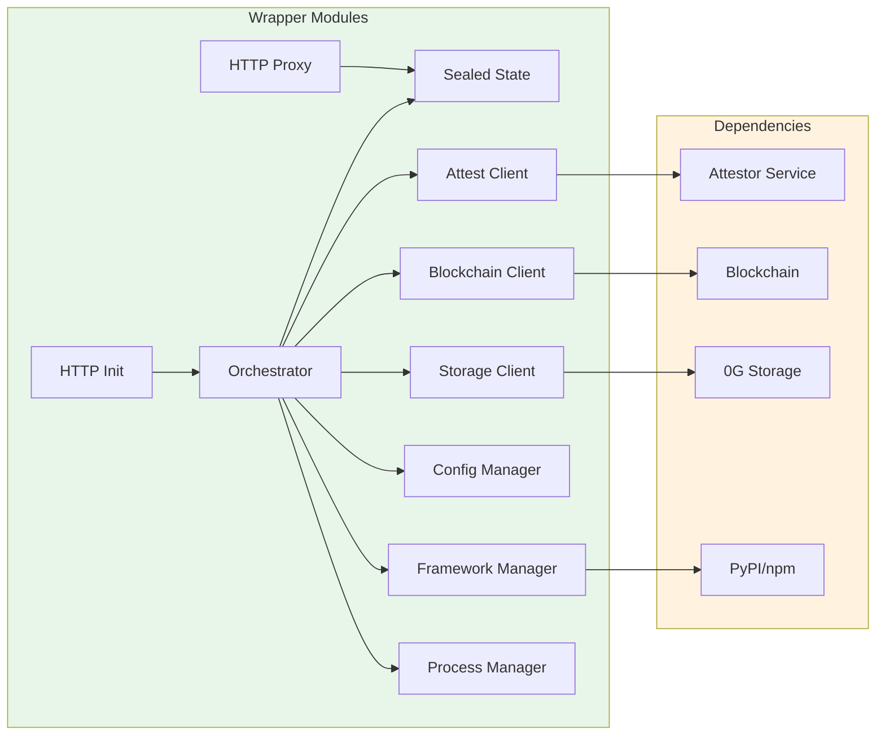

# Agent Wrapper Architecture

This document provides a complete overview of the Agent Wrapper architecture with visual diagrams.

## Table of Contents

- [Complete Architecture](#complete-architecture)
- [Component Overview](#component-overview)
- [Startup Sequence](#startup-sequence)
- [Request Flow](#request-flow)
- [State Management](#state-management)
- [Data Distribution](#data-distribution)

## Complete Architecture



## Component Overview

### Module Structure

```
internal/
├── attest/       # Attestor service client
├── blockchain/   # Blockchain client (ERC-7857/8004 queries)
├── config/       # Configuration encryption/decryption
├── flow/         # Initialization flow orchestrator
├── framework/    # Dynamic framework installation
├── init/         # HTTP initialization server
├── mock/         # Mock HTTP server for testing
├── process/      # Agent process management
├── proxy/        # HTTP proxy with ECDSA signing
└── sealed/       # Sealed state (keys, IDs)
```

### Module Responsibilities

| Module | Responsibility |
|--------|---------------|
| `internal/init` | HTTP server receiving init parameters |
| `internal/sealed` | Thread-safe key storage (key pair, agentSealKey, agentId) |
| `internal/attest` | Remote attestation with Attestor service |
| `internal/blockchain` | Query agentId and IntelligentData from blockchain |
| `internal/storage` | Fetch encrypted config from 0G Storage |
| `internal/config` | Decrypt and validate agent configuration |
| `internal/framework` | Dynamically install Python/Node.js frameworks |
| `internal/process` | Start/stop agent process with monitoring |
| `internal/proxy` | HTTP proxy with ECDSA response signing |
| `internal/flow` | Orchestrate complete initialization sequence |
| `internal/mock` | HTTP mock server for testing |

## Startup Sequence



## Request Flow



## State Management



## Data Distribution

### On-Chain vs Off-Chain

```mermaid
graph TB
    subgraph OnChain["Blockchain On-Chain"]
        AgentId[agentId: uint256]
        SealId[sealId: bytes32]
        AgentSeal[agentSeal: address]
        DataHash[dataHash: bytes32<br/>in intelligentData[0]]
    end

    subgraph OffChain["0G Storage Off-Chain (AES-256-GCM encrypted)"]
        EncryptedConfig[Encrypted Config]
        Framework[framework: {name, version}]
        Runtime[runtime: {entryPoint, workingDir, agentPort}]
        Env[env: {key-value pairs}]
    end

    subgraph RuntimeTEE["Runtime TEE Internal"]
        ImageHash[imageHash: from container]
        AgentSealKey[agentSealKey: private key<br/>never leaves TEE]
    end

    DataHash -->|fetch by hash| EncryptedConfig
    EncryptedConfig -->|decrypt with agentSealKey| Framework
    EncryptedConfig -->|decrypt with agentSealKey| Runtime
    EncryptedConfig -->|decrypt with agentSealKey| Env

    style OnChain fill:#e8f5e9
    style OffChain fill:#fff3e0
    style RuntimeTEE fill:#e1f5fe
```

### Data Flow Diagram

```mermaid
flowchart TD
    Start([Start: sealId]) --> QueryAgent[Query agentId]
    QueryAgent --> Blockchain{Blockchain Service}
    Blockchain -->|GET /agents/by-seal-id/{sealId}| GetAgentId[Get agentId]

    GetAgentId --> QueryData[Query IntelligentData]
    QueryData --> Blockchain2{Blockchain Service}
    Blockchain2 -->|GET /agents/{id}/intelligent-datas| DataList[IntelligentData[]]

    DataList --> Extract[Extract dataHash[0]]
    Extract --> FetchConfig[Fetch Encrypted Config]

    FetchConfig --> Storage{0G Storage}
    Storage -->|GET /config/{hash}| Encrypted[Encrypted Config]

    Encrypted --> Decrypt{Decrypt with agentSealKey<br/>AES-256-GCM}
    Decrypt --> AgentConfig[AgentConfig]

    AgentConfig --> Parse{Parse Fields}
    Parse --> Framework[framework]
    Parse --> Runtime[runtime]
    Parse --> Env[env]

    Framework --> Start[Start Agent]
    Runtime --> Start
    Env --> Start

    Start --> Ready([Ready])

    style Blockchain fill:#e8f5e9
    style Blockchain2 fill:#e8f5e9
    style Storage fill:#fff3e0
    style Decrypt fill:#e1f5fe
    style Start fill:#c8e6c9
```

## HTTP API Flow



## Dynamic Framework Installation

```mermaid
flowchart TD
    Start([Get Framework Config]) --> Check{Framework<br/>Supported?}

    Check -->|Python| Pip[pip install<br/>{framework}=={version}]
    Check -->|Node.js| Npm[npm install<br/>{framework}@{version}]
    Check -->|demo/unknown| Skip[Skip installation]

    Pip --> Verify{Success?}
    Npm --> Verify

    Verify -->|Yes| Continue[Continue startup]
    Verify -->|No| LogError[Log warning<br/>Continue anyway]

    Skip --> Continue

    LogError --> Continue
    Continue --> Done([Framework Complete])

    style Pip fill:#e8f5e9
    style Npm fill:#fff3e0
    style Skip fill:#e1f5fe
    style Continue fill:#c8e6c9
```

## Security Model

### Trust Boundaries



### Key Isolation

- **agentSeal Private Key** - Only in Wrapper process memory
- **Agent Process** - Cannot access Wrapper memory (process isolation)
- **TEE Protection** - Keys never leave TEE boundary
- **No Logging** - Private keys never logged or serialized

## Component Relationships


